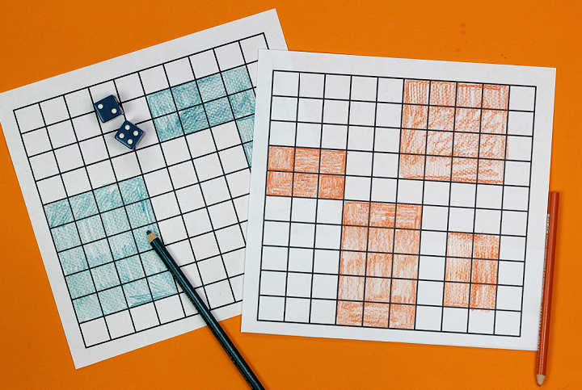

# voyage-project-tier1-arraygame

## Table of Contents

* [Overview](#overview)
* [General Instructions](#general-instructions)
* [Requirements & Specifications](#requirements-specifications)
* [Acknowledgements](#acknowledgements)
* [About Chingu](#about-chingu)

## Overview

The Array Game is designed to help early learners build and expand on their
multiplication skill for the numbers 1-6. Players use a simple grid that
visually represents the calculation.

The goal of this game is to help kids supplement what they are learning about
multiplication with a fun activity they use for practice. 

The objective of the game is for players to shade in as much of the 10x10 grid
as possible. Players take turns rolling dice and then shading an array whose
dimensions are equal to the numbers on the dice. 

For example, if you roll a 2 and a 3 you would shade in a 2x3 array on the 
grid either vertically or horizontally. In this example, the array could be 
either 2 rows by 3 columns or it could be 3 rows by 2 columns.

If it turns out that there's no room on the grid for your array, the player 
can't update the grid and must wait until their next turn to roll again.

The game will end when one of these conditions are reached:

1. A pre-defined period of time is reached. Whoever has the highest score wins.
2. A player forfeits two consecutive turns. In this situation, 
that player loses the game. 
3. A player completely fills in their grid. This will take longer than the first two options. Depending on the luck of the roll, players may end up forfeiting many turns.

## General Instructions

This project is designed to be worked on by a team rather than an individual
Chingu. This means you and your team will need to thoroughly read and
understand the requirements and specifications below, **_and_** define and
manage your project following the _Agile Methodology_ defined in the
[Voyage Handbook](https://chingucohorts.notion.site/Voyage-Guide-1e528dcbf1d241c9a93b4627f6f1c809).

As you create this project make sure it meets all of the requirements, but once
it reaches MVP, start implementing the optional features or get creative and
extend it in ways we haven't envisioned. In other words, use the power of
teamwork to make it distinctive and unique.

Take note that we haven't given specific direction on what your UI/UX should
look like. This is another area where you and your team can put your creativity 
to work! 

## Requirements & Specifications

### What You Need to Do

#### Structure

- [ ] This is a purely frontend application. No backend is required. 
- [ ] You may use any languages, tools, or libraries you prefer when designing and building this app. 
- [ ] You may **_NOT_** use AI-base solution generators like GitHub CoPilot.
- [ ] Useful links and resources:
    - [The Array Game](https://www.whatdowedoallday.com/array-game/)

#### Styling

- [ ] Surprise us!!!
- [ ] Add a footer containing a link to your teams GitHub repo
- [ ] In general, you will find these [UI design principles](https://www.justinmind.com/ui-design/principles) helpful.
- [ ] Recommend using this resource for [clean CSS](https://www.devbridge.com/articles/implementing-clean-css-bem-method/)

#### Functionality

-   User can see the game window with these components
    - Leaderboard showing the number of games the current player has won and lost
    - Game controls
    - A 10x10 grid the game is played on

- Leaderboard
    -   [ ] User can see the display of the total number of wins and losses for each 
    -   [ ] User can see the tally of wins for each of the three ways the game
    can end
    -   [ ] User can see the tally of losses for each of the three ways the game
    can end

- Game Controls
    -   [ ] User can see a button in the game control panel to start a new game, which updates the Leaderboard, clears the grid, and starts a new game.
    -   [ ] If the user tries to start a new game while one is in progress a modal alert will be displayed to confirm that the current game may be abandoned.
    -   [ ] When a game is started the user will see a button to roll the dice
    -   [ ] After rolling the dice a new roll will be blocked until the new 
    array has been marked on the grid by clicking squares in the grid
    -   [ ] User can see a the value of each dice after they are rolled
    -   [ ] The user will see a button to allow them to clear the grid and 
    to start refilling it using the values from the current roll. This allows
    the user to try different options.
    -   [ ] The user will see a button that allows them to submit their answer
    after filling in the grid from the current roll of the dice.

- Grid
    -   [ ] When the dice are rolled the user will be able to click on squares
    to mark their array.
    -   [ ] When a square is clicked it's color will change from the color used
    for unoccupied squares to the color designation for occupied squares.
    -   [ ] If the total number of squares marked on the grid don't match the
    numbers on the dice an error message must be issued and the user should be
    given the option to re-mark the grid to match the dice.

### Extras (Not Required)

-   [ ]  Implement the game to allow human-to-human competition between 2 
players or human-vs-computer competition.
-   [ ]  Allow the user to choose the color to be used to fill in the grid
-   [ ]  Maintain player metrics across sessions for the last 3 games that have 
been played
-   [ ]  Allow the user to specify the dimensions of the grid 
-   [ ]  Add a countdown timer showing time remaining in the game and create an
input field to allow the user to set the starting number of minutes and seconds.
-   [ ]  Animate the rolling of the dice
-   [ ]  Play a sound to simulate the rolling dice
-   [ ]  Add a graph to the leader board to show the number of times a number
has been rolled.
-   [ ]  Support dark/light mode

## About Chingu

If you aren’t yet a member of Chingu we invite you to join us. We help our 
members transform what they’ve learned in courses & tutorials into the 
practical experience employers need and want.

## Acknowledgements

Thanks to our friend [Florin Pop](https://twitter.com/florinpop1705) who 
contributed the initial version on his [App Ideas repo](https://github.com/florinpop17/app-ideas). 
